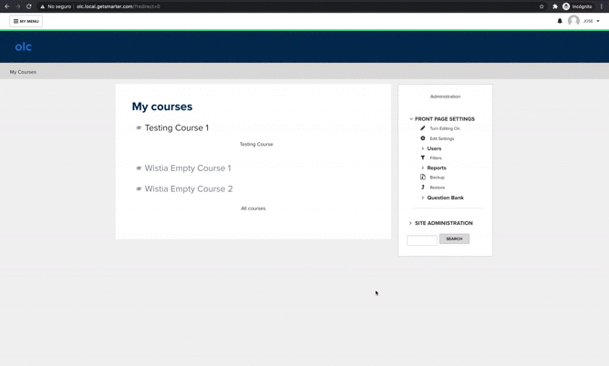
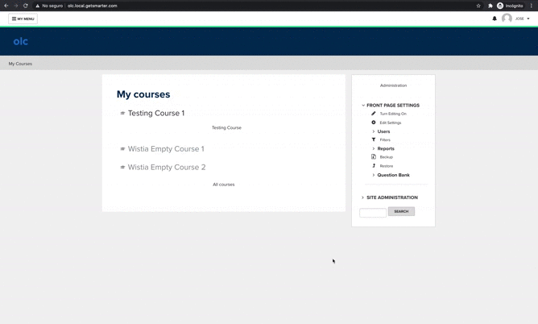
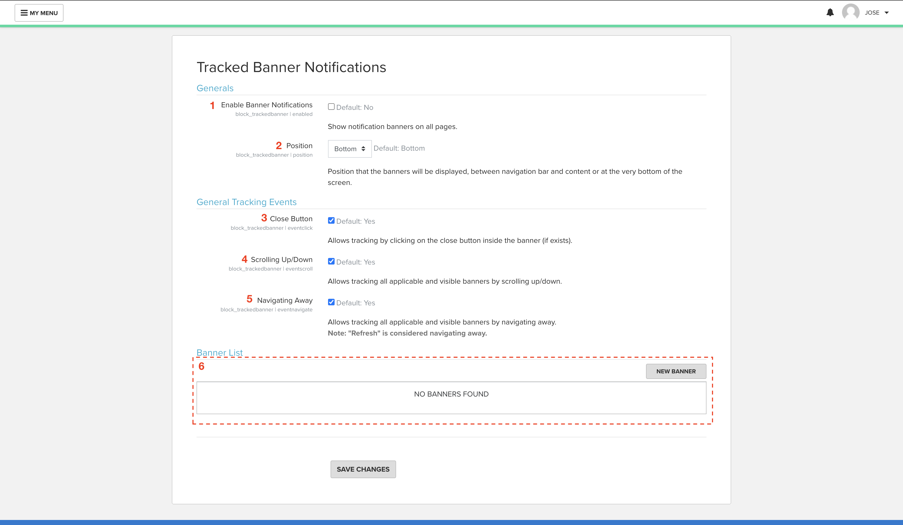
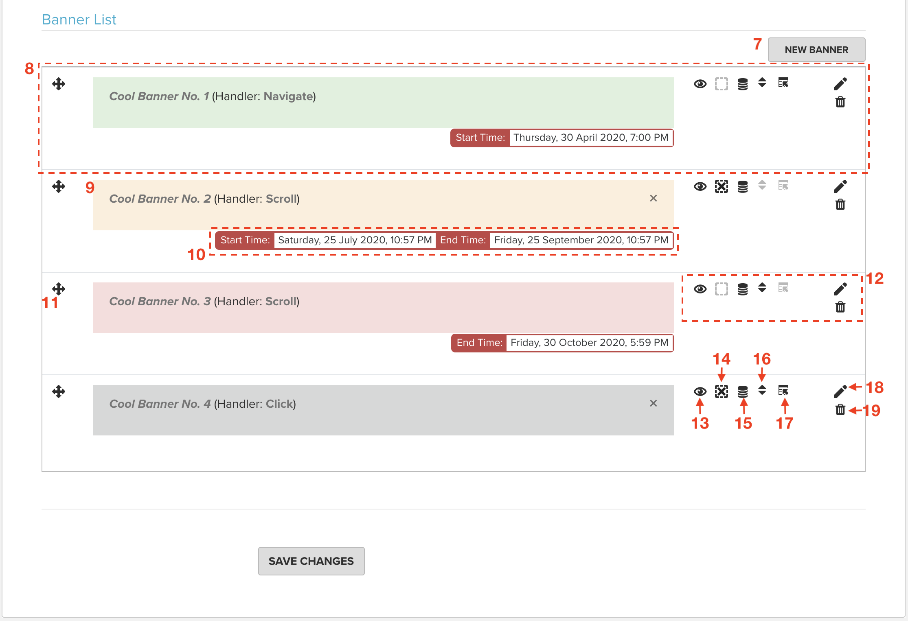
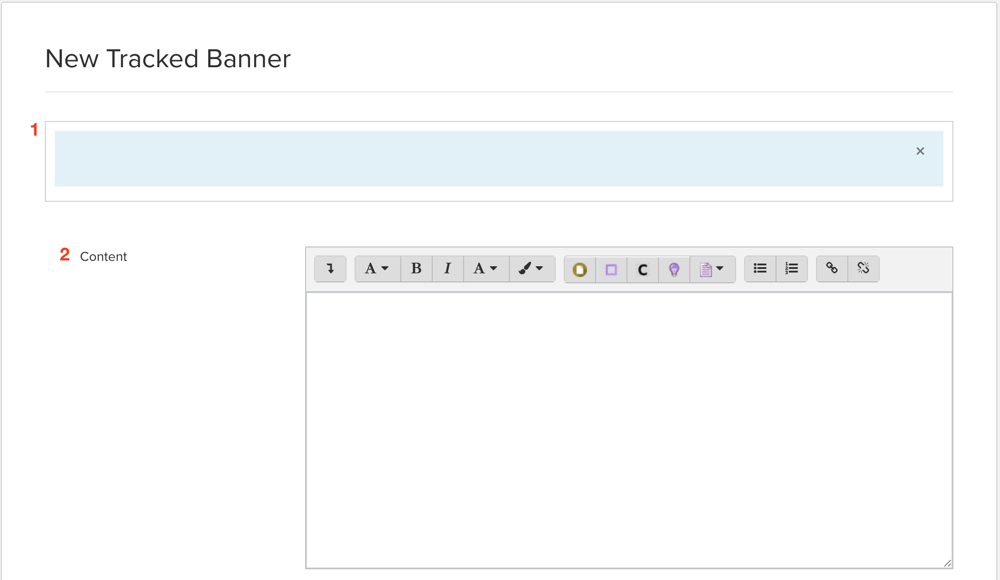
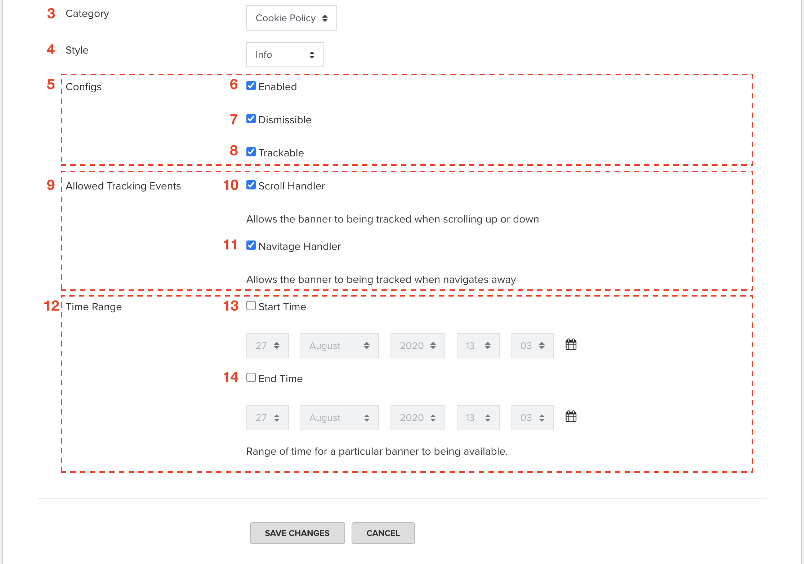
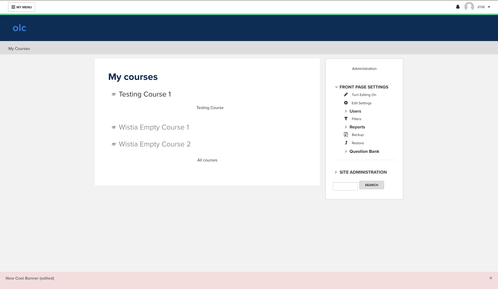

# Tracked Banner Notifications #

**Tracked Banner Notification** provides notification banners on the Home Page and stores the action in the DB to have a register of which users dismiss each banner. 

## License ##

2020 GetSmarter

This program is free software: you can redistribute it and/or modify it under
the terms of the GNU General Public License as published by the Free Software
Foundation, either version 3 of the License, or (at your option) any later
version.

This program is distributed in the hope that it will be useful, but WITHOUT ANY
WARRANTY; without even the implied warranty of MERCHANTABILITY or FITNESS FOR A
PARTICULAR PURPOSE.  See the GNU General Public License for more details.

You should have received a copy of the GNU General Public License along with
this program.  If not, see <http://www.gnu.org/licenses/>.

---

# How to use #

## Adding the banner to Home Page ##
Lets go to home page and add it...

1. First of all, **Turn Editing On** on **Home Page**.
2. Expand the combo within "**Add a Block**" block, and select **_Tracked Banner Notifications_**.
3. Finally **Turn Editing Off** for finishing editing.

---
## Set it up ##
---

## Location ##

- Navigate to **Site Administration > Plugins > Blocks > _Tracked Banner Notifications_**

## Settings Page ##
### Generals ###
Here you can find the settings page and all general features.

1. **Enable Banner Notifications** (Checkbox): Here you can select if the plugin is active or not in front page. (Default: No Checked/False)
2. **Position** (List): Position that the banners will be displayed, between navigation bar and content or at the very bottom of the screen.
3. **Close Button** (Checkbox): Allows tracking by clicking on the close button inside the banner (if exists). (Default: Checked/True)
4. **Scrolling Up/Down** (Checkbox): Enables/Disables the scrolling event for all banners. If you have some banners configured to being tracked by scrolling event this option must be checked. (Default: Checked/True)
5. **Navigating Away** (Checkbox): Enables/Disables the navigating event for all banners. If you have some banners configured to being tracked by navigating event this option must be checked. (Default: Checked/True)
6. **Banner List** (Section): Here you can find all your active banners its information (detailed below). 

### Banner List Section ###

7. **New Banner** (Button): Open the New Banner page to create a new banner.
8. **Banner Record**: Represents an existing and active banner, contains all the visual information from a particular banner.
9. **Banner**: Banner itself, here you can see the banner exactly how it is being displayed.
10. **Availability** (Container): Show the range of dates that the banner will be available if exists. Only existing information will be deplayed, "**Start date**" or "**End date**". A banner is consider "_in range_" when current date is between "**Start date**" and "**End date**", in the case one of them doesn't exist "**limit concept**" will apply. I.e. if **Start date** doesn't exist but **End date** does, the banner will be available **_until_** the final date.
11. **Draging Helper** (Helper): You can use this control to relocate (order) each banner to any position you want in the list, this will cause in fron page the banners will display in the same order.
12. **Actions Toolbar** (Container): Contain icons representing actions you can perform to each banner.
13. **Enable/Disable Switch** (Switch): Enable/Disable a banner. This tool can be useful when you don't want the users to see the banner for any reasons, but you want to keep it in the list for future purposes.
14. **Dismissing Switch** (Switch): Show/hide the close button from a banner. This button is used to dismiss/tracking the user action. If you want to use close button for tracking you must have **Close Button Event** enable.
15. **Tracking Switch** (Switch): Enable/Disable a banner to being tracked, this means no any action on it will be recorded. **Note**: If you make a banner "non-trackable", that banner will always showing up until it is removed, disabled or out of date range.
16. **Scrolling Switch** (Switch): Allow/Deny a banner to being tracked on scrolling. **(Tracking must be enabled)**
17. **avigating Switch** (Button): Allow/Deny a banner to being tracked on navigating away. **Note**: "Refreshing" browser is considered "navigating". **(Tracking must be enabled)**
18. **Edit** (Button): Open a form to modify the banner's data. 
19. **Remove/Delete** (Button): Remove the banner from any place making it unavailable.

### Adding/Editing banners ###

1. **Preview**: Preview banner to visualize how is your banner looking like.
2. **Conten**: Editor to type the needed content that will be shown in the banner.
3. **Category**: Classification of the banner (What is the banner used for).
4. **Style**: Visual design of the banner, assigning colors for us. Useful to give severity or visual impact.
5. **Configs Block**: This set of configs gives the banner some capabilities like the following...
6. **Enabled**: Allow the banner to being visible for all users, if this config is disabled the banner will be created but not visible. (You can change this config anytime you want with **Enable/Disable Switch** switch on the settings page)
7. **Dismissible**: Allow the banner to use **close button**, if this config is disabled the banner won't be able to being dismissed/tracked by clicking. (You can change this config anytime you want with **Dismissing Switch** switch on the settings page)
8. **trackable**: Allow the banner to being "tracked" or store the dismiss action from the user, if this config is disabled the banner won't be able to being dismissed/tracked by any event. (You can change this config anytime you want with **Tracking Switch** switch on the settings page)
9. **Allowed Tracking Events Block**: Here are all the handling events you can select for the current banner to being tracked to.
10. **Scroll Handler**: Allow the banner to being "tracked" by scrolling up/down. (You can change this config anytime you want with **Scrolling Switch** switch on the settings page)
11. **Navigate Handler**: Allow the banner to being "tracked" by navigating away to any page. (You can change this config anytime you want with **Navigating Switch** switch on the settings page)
12. **Time Range Block**: Set of date/time controls to make the banner available between a range of time. If you only use one of those dates "limit concept" will apply. (I.e. if **Start date** doesn't exist but **End date** does, the banner will be available **_until_** the final date.)
13. **Start Date**: Date which a banner will be available from.
14. **End Date**: Date until which a banner will be available.

## Enable notifications ##

---
##  Lets see how it looks like ##
---

### Now you should see them. ###

